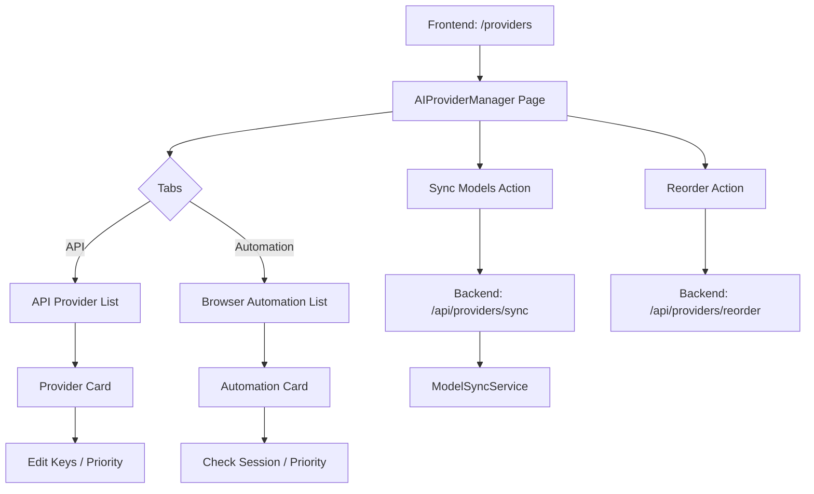

# AI Provider Management Redesign Plan

## 1. Goal
The goal is to fix the non-functional `/admin/providers` page, move it to `/providers`, and update its UI to match the modern dark theme of the app. It will also consolidate both API-based and Browser Automation-based providers.

## 2. Architecture Changes

### 2.1 Database Model ([`backend/models/AIProvider.js`](backend/models/AIProvider.js))
Add the following fields:
- `type`: `'api'` | `'browser'`
- `capabilities.automation`: `boolean`
- `description`: `string` (for UI display)

### 2.2 Backend API ([`backend/controllers/aiProviderController.js`](backend/controllers/aiProviderController.js))
- Update `getProvidersWithModels` to return categorized providers.
- Add better error handling and logging.

### 2.3 Seeding ([`backend/scripts/seed-all-providers.js`](backend/scripts/seed-all-providers.js))
- A new script to populate the database with all known providers.

## 3. Frontend UI Redesign

### 3.1 Routing
- Move from `/admin/providers` to `/providers`.
- Update Navbar to use `Link` component.

### 3.2 UI Components ([`frontend/src/pages/AIProviderManager.jsx`](frontend/src/pages/AIProviderManager.jsx))
- **Theme**: Dark mode (Gray-900 background).
- **Layout**:
    - **Header**: Title, Sync button.
    - **Tabs**: [API Providers] [Browser Automation].
    - **Provider Cards**:
        - Icon (Lucide-react).
        - Name & Status Badge.
        - Capabilities Badges (Text, Vision, Image, Video, Automation).
        - Priority Control (Up/Down).
        - Configuration (API Keys or Session info).
        - Models List (collapsible).

### 3.3 Visual Improvements
- Use `framer-motion` for transitions.
- Use `lucide-react` for consistent iconography.
- Implement better loading states and empty states.

## 4. Mermaid Diagram

## 5. Implementation Steps
1. Update Backend Model & Seed Data.
2. Update Frontend Route & Navbar.
3. Completely rewrite AIProviderManager.jsx with new UI.
4. Test all interactions (enable/disable, reorder, sync).
